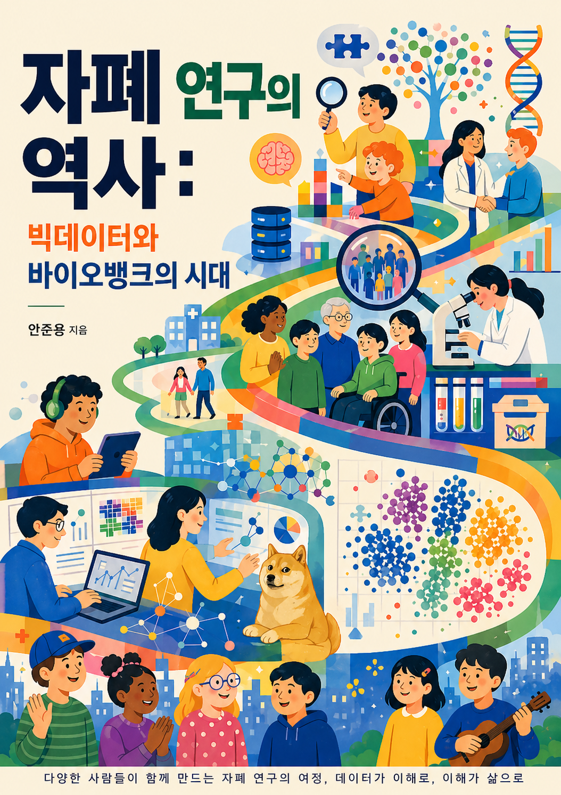

# 자폐 연구의 역사: 빅데이터와 바이오뱅크의 시대

안준용 (고려대학교 보건과학대학 바이오시스템의과학부)

초안 작성 중 | 작성일 2026년 4월 25일 | 수정일 2026년 4월 26일

  

---

자폐스펙트럼장애의 유전학은 한 번에 완성된 분야가 아니다. 오랫동안 연구자들은 가족 연구와 쌍둥이 연구를 통해 유전적 요인이 크다는 사실을 알고 있었지만, 어떤 변이가 어떤 생물학적 경로와 이어지는지는 잘 알지 못했다. 전환점은 2007년에 왔다. 부모에게는 없고 자녀에게서 새로 생긴 신생 구조 변이가 자폐와 연관된다는 증거가 나오면서, 자폐 연구는 행동 특성의 비교를 넘어 유전체를 직접 읽는 단계로 들어섰다. 그 뒤 수만 가족의 유전체가 분석되었고, 현재는 185개의 위험 유전자가 확인되었다. 유전자에서 세포로, 세포에서 회로로 이어지는 설명도 조금씩 구체화되었다. 이 책은 그 변화가 어디까지 왔고, 무엇을 밝혔으며, 아직 어디에서 멈춰 있는지를 차분히 따라가려는 시도다.

이 변화는 특정한 연구자 한두 명의 업적으로 이루어진 일이 아니다. 지난 20년 동안 수많은 가족이 자신의 유전체 정보와 임상 정보를 연구에 제공했고, 여러 나라의 연구팀이 데이터를 모으고 다시 분석하고 서로의 결과를 확인했다. SSC의 2,600가족, SPARK의 50만 명, MSSNG의 11,000명, 한국의 K-ARC는 그런 협력의 이름들이다. 코호트는 숫자의 집합처럼 보이지만, 실제로는 연구에 참여한 사람들의 시간과 신뢰가 쌓인 결과다. 이 협력이 없었다면 드문 변이를 반복해서 확인할 수도, 작은 효과를 가진 변이의 통계적 신호를 구분할 수도 없었을 것이다. 그래서 이 책은 연구 성과만이 아니라 그 성과가 만들어진 조건까지 함께 설명하려 한다. 연구에 참여한 가족들이 "내가 제공한 데이터로 과학이 무엇을 알아냈는지"를 이해할 수 있어야 한다는 생각이 이 책의 출발점이다.

이 책은 유전학 교과서의 형식을 따르지 않는다. 중심에 둔 독자는 연구자가 아니라 유전학 바깥에 있는 사람들이다. 자폐를 가진 아이의 부모는 진료실에서 유전 검사 결과지를 받았지만, 거기에 적힌 유전자 이름과 변이 표기가 어떤 의미인지 나중에 다시 확인하고 싶을 수 있다. 특수교육을 공부하는 학생이나 학교 현장에서 아이를 만나는 교사도, 행동 특성을 생물학적 설명과 함께 이해할 필요가 있다. 유전학에 관심이 생긴 고등학생에게는 용어의 문턱이 먼저 다가올 수 있다. 그래서 본문은 전문 용어가 처음 나오는 자리에서 뜻을 풀고, 필요할 때만 비유를 붙인다. 설명은 쉽게 하되, 연구가 말할 수 있는 범위와 아직 말하지 못하는 범위를 구분하는 데 초점을 두었다.

# 책의 구성

이 책은 7개의 파트로 짜여 있다.

Part 1은 자폐가 무엇인지를 다룬다. 진단의 역사, 진단 기준의 변천, 넓은 자폐 표현형, 이질성, 유병률의 변화를 살펴본다.

Part 2는 대규모 코호트의 시대를 다룬다. SSC, SPARK, MSSNG, K-ARC 같은 코호트가 어떻게 만들어졌고, 왜 수만 가족의 데이터가 필요했는지를 설명한다.

Part 3은 자폐 유전 변이의 지형도를 그린다. 신생 구조 변이에서 시작해 엑솜 시퀀싱, 유전되는 희귀 변이, 양적유전 구조, 전장 유전체 시퀀싱, 비코딩 변이, 반복 서열, 열성 변이까지 유전 변이의 모든 유형을 다룬다.

Part 4는 자폐의 다양성을 유전적 관점에서 다룬다. 유전적 이질성, 표현형 아형, 성차와 여성 보호 효과, 역치 모형, 동반 질환, 정신질환 간 유전적 교차를 살펴본다.

Part 5는 수렴의 논리를 다룬다. 수백 개의 서로 다른 유전자가 왜 비슷한 표현형으로 이어지는지, 세 가지 경로의 수렴, 전사 조절 인자의 공유, 발달 시점과 세포 유형의 특이성을 설명한다.

Part 6은 기전을 찾아가는 과정을 다룬다. 사후 뇌 전사체, 오가노이드, CRISPR 스크리닝, 모체 면역 활성화, 장내 미생물, 미세아교세포, 그리고 아세트아미노펜 논란까지.

Part 7은 데이터에서 삶으로 향한다. 개별 유전자의 기능(SHANK, CHD8, SCN2A, SYNGAP1), 약물 치료의 시도와 교훈, ASO 정밀 의학, 그리고 성인 자폐인의 삶, 늦게 진단받은 여성들, 건강 격차, 가족과 돌봄의 문제를 다룬다.

각 장 끝에는 그 장에서 인용한 논문 목록을 실었다. 관심 있는 독자가 원문을 직접 찾아볼 수 있게 하기 위해서다.

# 읽는 방법

이 책은 처음부터 끝까지 읽어도 되지만, 독자의 필요에 따라 다른 길로 들어가도 된다. 자폐라는 진단의 의미와 유병률 변화가 궁금한 독자는 Part 1에서 시작하면 된다. 유전 검사 결과지에 적힌 유전자 이름과 변이 표기가 궁금한 독자는 Part 3을 읽은 뒤 36장으로 넘어가면 흐름이 잡힌다. 코호트와 빅데이터가 왜 필요한지 알고 싶은 독자는 Part 2를 먼저 읽고, 치료 연구와 실제 삶의 문제를 보고 싶은 독자는 Part 7을 먼저 펼쳐도 된다. 전문 용어가 걸리면 앞의 용어 길잡이를 잠깐 확인하고 다시 본문으로 돌아오면 된다. 이 책의 목표는 한 번에 모든 내용을 외우게 하는 것이 아니라, 낯선 연구 결과를 만났을 때 스스로 판단할 수 있는 지도를 제공하는 데 있다.

부모 독자라면 먼저 5장, 13장, 36장을 읽어도 좋다. 이 세 장은 유전율, 양적유전, 유전 검사 결과가 무엇을 말하고 무엇을 말하지 못하는지를 차례로 설명한다. 교사나 특수교육을 공부하는 독자라면 1장부터 4장까지 읽은 뒤 44장과 45장으로 넘어가면, 진단의 변화와 성인기 삶의 문제를 함께 볼 수 있다. 과학 연구의 흐름을 따라가고 싶은 독자는 Part 2와 Part 3을 먼저 읽으면, 왜 수만 가족의 데이터와 국제 협력이 필요했는지 이해하기 쉽다. 의료와 정책의 실제 판단에 관심이 있는 독자는 35장과 43장을 함께 읽으면, 관찰 연구와 AI 진단 기술을 해석할 때 무엇을 조심해야 하는지 볼 수 있다. 숫자가 부담스러운 독자는 표와 위험비를 처음부터 모두 해석하려 하지 말고, 본문이 붙여 둔 "이 숫자가 뜻하는 것"과 "이 숫자로 말할 수 없는 것"을 먼저 읽으면 된다.
