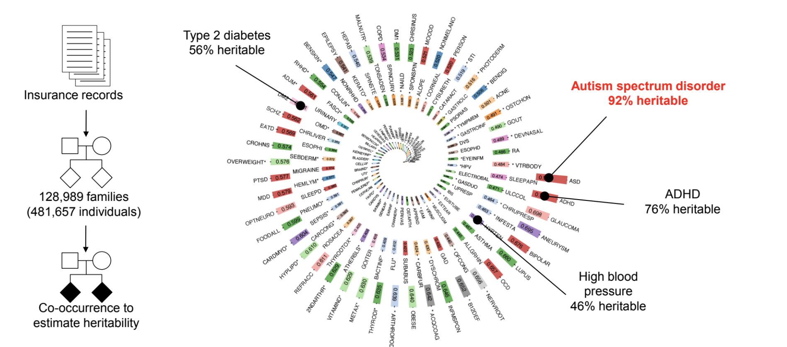

# 13장. 일반 변이와 양적유전 구조

# 자폐스펙트럼장애는 가장 유전력이 높은 형질 중 하나다

모든 인간 질환이 같은 정도로 유전의 영향을 받는 것은 아니다. 어떤 질환은 유전적 요인의 기여가 크고, 어떤 질환은 환경적 요인이 더 큰 역할을 한다. 유전력(heritability)이란 인구 집단에서 특정 질환의 발생 빈도 차이 중 유전적 요인으로 설명되는 비율을 뜻하는데, 5장에서 가족 내 재발 패턴을 통해 이미 소개한 바 있다. 그렇다면 자폐스펙트럼장애의 유전력은 다른 질환들과 비교할 때 어느 정도 수준일까?

Wang et al. (2017) 연구는 이 질문에 가장 포괄적인 비교 자료를 내놓았다. 이 연구는 미국의 건강보험 청구 기록(Truven MarketScan)에서 128,989개 가족, 481,657명의 개인 데이터를 추출하여, 가족 구성원 사이의 질환 동시 발생(co-occurrence) 패턴으로부터 560개 질환의 유전력을 추정했다. 쌍둥이 연구나 입양 연구가 아니라, 보험 기록에서 파악되는 1차 친척 관계를 이용했다. 이 방법은 특정 질환에 초점을 맞추는 것이 아니라, 인간이 겪는 거의 모든 흔한 질환을 한 번에 비교한다는 장점이 있다.

자폐스펙트럼장애의 유전력은 약 0.9, 즉 90%에 달했다. 이것은 분석된 560개 질환 중 가장 높은 수준이다. 비교하면 ADHD는 약 76%, 제2형 당뇨는 56%, 고혈압은 46%로 추정되었다. 유전력 90%라는 수치는 5장에서 소개한 스웨덴 가족 연구(Sandin et al. 2014)의 추정치 50%보다 상당히 높은데, 이 차이는 방법론에서 비롯된다. Sandin 연구가 추정한 것은 좁은 의미의 유전율(narrow-sense heritability), 즉 개별 유전 변이의 효과가 단순히 더해지는 부분(가산적 효과)만 포함한 값이다. 반면 Wang 연구를 비롯한 쌍둥이 연구들이 보고하는 높은 유전력은, 유전 변이 사이의 상호작용이나 우성 효과까지 포함한 넓은 의미의 유전율(broad-sense heritability)에 가깝다. 어떤 추정 방법을 쓰든 결론은 같다. 자폐스펙트럼장애는 인간 질환 중에서 유전적 기여가 가장 큰 질환 중 하나다.

이 문장을 읽을 때도 유전력이라는 숫자를 개인의 운명으로 옮겨 적어서는 안 된다. 유전력 90%는 한 아이의 자폐 특성 중 90%가 유전 때문에 정해졌다는 뜻이 아니다. 그것은 특정 인구 집단 안에서 사람들 사이의 차이가 유전적 차이와 얼마나 함께 움직이는지를 추정한 값이다. 집단의 통계가 높게 나와도 한 사람의 발달 경로는 유전 변이, 임신과 출생 전후의 조건, 의료와 교육 지원, 가족과 지역사회의 환경 속에서 달라진다. 그래서 이 숫자는 부모에게 책임을 묻는 도구가 아니라, 자폐가 인간 유전체의 다양성 안에서 이해되어야 한다는 사실을 보여주는 출발점으로 읽어야 한다.

그렇다면 이 높은 유전력을 구성하는 유전적 요인은 무엇일까? 파트 3의 앞선 장들에서 다룬 신생 구조 변이(10장), 신생 코딩 변이(11장), 유전되는 희귀 변이(12장)는 모두 개별 가족에서 강한 효과를 내는 변이들이다. 하지만 인구 수준에서 이 변이들이 설명하는 유전력의 비율은 전체의 일부에 불과하다. 유전력의 대부분을 만들어내는 것은, 직관과 어긋나지만, 개별적으로는 거의 효과가 없는 수천 개의 일반 변이(common variant)가 합쳐진 결과다.

이 개념을 이해하기 위해 키를 생각해보자. 한 사람의 키가 180cm인 이유를 단 하나의 "키 유전자"로 설명할 수 있을까? 그렇지 않다. 인간의 키에 영향을 미치는 유전적 요인은 수천 개에 달하며, 각각은 키를 1mm 정도 높이거나 낮추는 아주 작은 효과를 낸다. 어떤 사람이 유난히 키가 큰 이유는, 이 수천 개의 작은 효과 가운데 키를 높이는 방향으로 작용하는 변이가 우연히 많이 모여 있기 때문이다. 이렇게 하나의 특성이 많은 수의 유전 변이에 의해 결정되는 구조를 양적유전(polygenic) 구조라 부른다. '다유전자'라는 번역어를 흔히 쓰기도 하지만, 이 말은 유전자가 여러 개라는 뜻으로 오해를 부른다. 실제로는 유전자가 아니라 유전 변이가 여러 개 관여하는 것이므로, 양적유전이 더 정확한 표현이다.

자폐스펙트럼장애의 유전적 구조도 키와 비슷하다. Gaugler et al. (2014) 연구는 이 점을 대표적으로 보여준다. 스웨덴의 160만 가족이 넘는 역학 데이터와 유전체 데이터를 결합하여, 자폐의 좁은 의미의 유전율(narrow-sense heritability), 즉 유전으로 설명되는 자폐 위험의 비율을 약 54%로 추정했다. 유전율 54%란, 자폐가 발생할 위험의 절반 이상이 유전적 요인으로 결정된다는 뜻이다. 그리고 이 유전율 중 일반 변이가 차지하는 부분을 따로 추정했더니 약 49%였다. 전체 유전율 54%와 일반 변이에 의한 유전율 49%의 차이가 5%에 불과하다는 것은, 유전에 의한 자폐 위험의 거의 전부가 인구에서 흔한 일반 변이로 설명된다는 의미다.

이 결과는 개인 수준의 경험과 인구 수준의 통계를 구분하는 일이 왜 중요한지 보여준다. CHD8 유전자에 기능 상실 변이를 가진 한 사람에게는, 그 변이가 자폐의 주된 원인이다. 하지만 인구 전체를 놓고 보면 CHD8 변이를 가진 사람은 극소수이므로, 인구 수준에서 자폐 위험을 설명하는 비율은 작다. 반면 일반 변이 하나하나는 개인 수준에서 거의 눈에 띄지 않을 만큼 작은 효과를 내지만, 인구에서 흔하기 때문에 전체적으로 합산하면 가장 큰 위험 요인이 된다. 희귀 변이와 일반 변이는 자폐라는 같은 결과에 기여하지만, 서로 다른 해상도에서 작동한다.

# GWAS가 보여준 것

일반 변이와 자폐의 연관을 찾기 위한 표준적인 방법은 유전체 전체 연관 분석(genome-wide association study, GWAS)이다. GWAS는 수만 명의 참여자와 대조군에서 수백만 개의 일반 유전 변이의 빈도를 하나하나 비교하여, 자폐 진단군에서 유의하게 더 흔한 변이를 찾는다. 원리는 간단하다. 특정 위치의 유전 변이가 자폐 진단군에서 60%의 빈도로 관찰되고 대조군에서 50%라면, 이 차이가 통계적으로 유의한지를 검정한다. 문제는 유전체 전체에서 수백만 개의 위치를 동시에 검정하므로, 우연에 의한 거짓 양성(false positive)을 걸러내기 위해 매우 엄격한 유의 수준(통상 p < 5 × 10⁻⁸)을 적용해야 한다는 데 있다. 이 기준을 통과하려면 매우 큰 표본 크기가 필요하다.

자폐 GWAS의 역사는 그래서 초기에는 좌절의 역사이기도 했다. Anney et al. (2012) 연구는 개별 일반 변이가 자폐 위험에 미치는 효과가 매우 작다는 사실을 확인하면서, 수만 명 이상의 코호트가 필요함을 시사했다. 조현병에서도 비슷한 과정이 있었다. 초기 GWAS는 번번이 유의한 좌위를 찾지 못했지만, 2014년에 약 3만 7천 명의 참여자를 모은 대규모 연구가 108개의 위험 좌위를 발견하면서 전환점이 왔다.

자폐에서도 규모의 전환이 왔다. Grove et al. (2019) 연구는 자폐 진단군 18,381명과 대조군 27,969명을 메타분석하여, 처음으로 5개의 유전체 수준 유의 좌위를 확인했다. 일반 변이로 설명되는 유전율은 약 11%로 추정되었다. 앞서 Gaugler 연구가 일반 변이에 의한 유전율을 49%로 추정한 것과 이 11%는 모순처럼 보일 수 있는데, 둘 다 맞다. 49%는 일반 변이 전체가 합쳐서 설명하는 유전율이고, 11%는 현재 GWAS로 포착 가능한 일반 변이만으로 설명되는 부분이다. 아직 발견되지 않은 일반 변이의 효과가 나머지를 채울 것으로 기대된다.

Grove 연구는 자폐가 다른 정신 질환 및 인지적 특성과 유전적 상관(genetic correlation)을 보인다는 사실도 확인했다. 유전적 상관이란 두 특성에 기여하는 유전 변이가 부분적으로 겹친다는 뜻이다. 자폐는 조현병, ADHD와 유전적 상관을 보였고, 교육 수준(educational attainment)과도 연관이 있었다. 자폐의 유전적 위험에 기여하는 일반 변이 중 일부가 다른 정신 질환의 위험에도 기여하고, 인지 능력과도 관련된다는 의미다. 이 교차 질환 유전적 상관은 파트 4에서 더 자세히 다룬다.

# 일반 변이와 희귀 변이는 함께 작용한다

자폐의 유전적 구조를 이해하는 핵심 중 하나는 일반 변이와 희귀 변이가 서로 배타적이지 않고 함께 작용한다는 사실이다. Weiner et al. (2017) 연구는 양적유전 전달 불균형 검정(polygenic transmission disequilibrium test, pTDT)이라는 방법을 개발하여 이 점을 직접 보여주었다. 방법은 이렇다. 먼저 GWAS에서 확인된 수천 개의 일반 변이 각각에 그 효과 크기를 가중치로 곱하여 합산한 점수, 즉 양적유전점수(polygenic score, PS)를 계산한다. 이 점수는 한 사람의 자폐 유전적 위험을 하나의 숫자로 요약한 값이라고 보면 된다. 그런 다음, 이 점수가 부모에서 자녀로 전달될 때 자폐를 가진 자녀에게 더 높은 점수가 전달되는지를 검정한다.

6,454개 자폐 가족에 이 방법을 적용한 결과, 자폐 진단군에게 자폐, 조현병, 교육 수준의 양적유전점수가 유의하게 더 많이 전달되고 있었다. 가장 중요한 발견은, 이 과잉 전달이 신생변이를 가진 사람에게서도 관찰된다는 사실이었다. CHD8 같은 유전자에 강한 효과의 신생변이를 가진 사람에게서도, 일반 변이로 인한 양적유전 위험이 추가로 작용하고 있었다. 자폐의 유전적 위험이 단일 요인에서 비롯되지 않고, 여러 종류의 유전 변이가 층층이 쌓이는 구조라는 의미다. 큰 효과의 희귀 변이가 있더라도 그 위에 일반 변이의 양적유전 위험이 더해져야 비로소 자폐 표현형이 나타나는 경우가 있다. 역으로, 같은 신생변이를 가져도 양적유전 위험이 낮은 사람에게서는 자폐가 나타나지 않을 수 있다. 같은 유전 변이를 가져도 표현형이 다른 불완전 침투도(incomplete penetrance) 현상의 한 가지 설명이 여기서 나온다.

여기서 양적유전 구조가 흔히 유발하는 오해 하나를 짚고 넘어가야 한다. "자폐의 유전적 위험이 부모에게서 자녀로 전달된다"는 사실은, "자폐 위험이 높은 부모의 자녀는 반드시 자폐 위험이 높다"는 뜻이 아니다. 양적유전에서 형질에 기여하는 유전 변이는 수백만 개에 달하며, 부모가 자녀에게 전달하는 것은 이 수백만 개 중 무작위로 선택된 절반이다. 게다가 생식세포가 만들어질 때 염색체에서 재조합이 일어나, 고스톱 판을 섞듯 유전 변이들의 조합이 뒤섞인다. 그래서 키가 큰 부모의 자녀가 반드시 키가 큰 것이 아니듯, 자폐의 양적유전 위험이 높은 부모의 자녀가 반드시 높은 위험을 물려받지는 않는다. 전달되는 유전 변이의 조합은 사실상 무작위에 가깝다.

이 점을 오해하면 위험한 결론에 다다를 수 있다. "똑똑한 사람들끼리 결혼하면 똑똑한 아이가 태어난다"거나 "특정 집안은 유전적으로 우월하다"는 식의 해석은 우생학의 근거가 되어왔다. 하지만 양적유전의 수학적 구조는 이런 해석을 지지하지 않는다. 수백만 개의 유전 변이가 무작위로 전달되는 상황에서, 어떤 개인의 유전적 구성을 부모의 유전적 구성으로부터 정확히 예측하기란 불가능하다. 양적유전이 우리에게 말해주는 것은 "모든 사람은 형질의 어느 분포에 위치할 확률을 가진다"이지, "어떤 사람의 유전적 배경 때문에 그 사람과 집안은 늘 그럴 것이다"가 아니다.

# 양적유전이 우리에게 말해주는 것

양적유전 구조를 이해하는 것이 실제로 우리에게 어떤 의미를 가지는지를 물어야 할 때가 되었다. 이 질문은 학술적인 데서 그치지 않고, 자폐를 가진 사람들과 가족들이 직면하는 현실적 질문이기도 하다.

만약 자폐가 소수의 유전 변이로만 발생하는 형질이라면, 그것은 특정 소수의 사람들에게만 나타나는 특수한 상태일 것이다. 하지만 양적유전 구조는 정반대의 그림을 보여준다. 자폐의 위험에 기여하는 일반 유전 변이는 수천 개에 달하며, 이 변이들은 인구 전체에 넓게 퍼져 있다. 진화의 과정에서 인류가 오랜 시간에 걸쳐 누적해온 변이들이다. 자폐뿐 아니라 키, 혈압, 인지 능력, 성격 특성 등 우리가 관찰하는 거의 모든 인간의 형질이 이런 구조를 따른다. 어떤 사람이든 자녀를 낳았을 때 그 자녀가 자폐를 가질 생물학적 확률은 존재한다. 특정 가족이나 집단에 국한된 위험이 아니라, 인간이라는 종의 유전적 구조에 내재된 확률이다.

이 대목에서 중요한 점은 양적유전 구조를 이해하는 일이 자폐를 낙인이나 가름의 도구로 쓰는 것과 정반대 방향으로 이어져야 한다는 데 있다. 자폐로 진단받은 사람들이 우리 사회에 언제나 존재할 수 있다는 것, 그것이 특정 누군가의 잘못이나 특정 가족의 유전적 부족함이 아니라 인간 유전체의 구조적 특성이라는 것을 유전학이 보여주고 있기 때문이다. 양적유전 연구가 가져야 할 방향은 개인을 선별하거나 위험을 예측해 분류하는 데 있지 않고, 자폐를 가진 사람들에게 직접적인 도움을 제공하는 데 있다. 같은 자폐 진단 안에서도 양적유전 배경이 다르면 동반 질환의 양상이 달라지고, 약물 반응이 달라지며, 필요한 지원의 종류가 달라진다. 양적유전 연구는 이 다양성을 이해하고, 각 개인에게 맞는 생애주기별 지원을 설계하는 데 기여한다. 파트 7에서 다루는 바이오마커 기반 치료 층화가 바로 이 방향의 연구다.

현재 양적유전점수(PS)는 개인 수준에서 자폐를 예측하기에는 정확도가 아직 충분하지 않다. 한계이기도 하지만, 동시에 양적유전점수가 개인을 낙인찍는 도구로 오용되기 어렵다는 뜻이기도 하다. 양적유전점수의 진정한 가치는 개인 예측이 아니라 인구 수준에서 자폐의 생물학을 이해하는 데 있으며, 그 이해가 결국 자폐를 가진 사람들의 삶을 개선하는 연구로 이어지는 것이 이 분야의 목표다.

따라서 양적유전점수를 둘러싼 실용적 질문은 "이 점수로 누구를 골라낼 수 있는가"가 아니다. 더 중요한 질문은 "같은 자폐 진단 안에서 왜 어떤 사람은 뇌전증이 두드러지고, 어떤 사람은 불안과 우울이 더 크게 나타나며, 어떤 사람은 특정 약물에 다르게 반응하는가"다. 양적유전 연구가 충분히 성숙하면, 이런 차이를 설명하는 데 작은 단서들을 제공할 수 있다. 다만 그 단서는 어디까지나 다른 임상 정보와 함께 해석되어야 하며, 한 사람의 삶을 숫자 하나로 요약하는 방식이 되어서는 안 된다. 이 경계를 지킬 때, 양적유전 연구는 낙인이 아니라 지원을 정교하게 만드는 지식이 될 수 있다.

이 장에서 다룬 일반 변이의 양적유전 구조는 자폐의 유전적 그림에서 가장 큰 영역을 차지하면서도 가장 해상도가 낮은 부분이다. 개별 일반 변이의 효과가 너무 작아서 어떤 특정 변이가 어떤 생물학적 경로로 뇌에 영향을 미치는지를 추적하기가 극히 어렵기 때문이다. 더 큰 코호트와 더 정교한 분석 방법이 이 해상도를 높여갈 것으로 기대된다. 지금까지 엑솜 시퀀싱이 유전체의 1.5%에서 코딩 변이를 찾아내는 데 집중했다면, 나머지 98.5%에는 유전자의 발현을 조절하는 다양한 스위치들이 존재하고 그 안의 변이도 자폐에 기여할 수 있다.

# 이 장을 삶으로 옮길 때

양적유전 구조는 자폐를 예측하는 개인용 점수표가 아니다. 수많은 일반 변이가 인구 전체에서 작은 효과를 더하며 분포한다는 통계적 설명이다. 부모와 예비 부모는 유전율이나 양적유전점수를 “내 아이가 자폐가 될 확률”로 직접 읽지 않아야 한다. 당사자에게도 이 숫자는 자기 삶의 가치나 가능성을 재는 척도가 아니다. 정책과 교육의 관점에서는 개인 선별보다, 자폐 관련 특성이 넓게 분포하는 사회에서 어떤 환경 조정과 정신건강 지원이 필요한지 묻는 데 더 쓸모가 있다. 이 장은 유전학이 결정론이 아니라 복잡성을 다루는 학문이라는 점을 보여준다.

## 참고문헌

Anney, R., Klei, L., Pinto, D., Almeida, J., Bacchelli, E., Baird, G., ... & Devlin, B. (2012). Individual common variants exert weak effects on the risk for autism spectrum disorders. *Human Molecular Genetics*, 21(21), 4781-4792. doi:10.1093/hmg/dds301

Gaugler, T., Klei, L., Sanders, S. J., Bodea, C. A., Goldberg, A. P., Lee, A. B., ... & Buxbaum, J. D. (2014). Most genetic risk for autism resides with common variation. *Nature Genetics*, 46(8), 881-885. doi:10.1038/ng.3039

Grove, J., Ripke, S., Als, T. D., Mattheisen, M., Walters, R. K., Won, H., ... & Børglum, A. D. (2019). Identification of common genetic risk variants for autism spectrum disorder. *Nature Genetics*, 51(3), 431-444. doi:10.1038/s41588-019-0344-8

Wang, K., Gaitsch, H., Poon, H., Cox, N. J., & Rzhetsky, A. (2017). Classification of common human diseases derived from shared genetic and environmental determinants. *Nature Genetics*, 49(9), 1319-1325. doi:10.1038/ng.3903

Weiner, D. J., Wigdor, E. M., Ripke, S., Walters, R. K., Kosmicki, J. A., Grove, J., ... & Robinson, E. B. (2017). Polygenic transmission disequilibrium confirms that common and rare variation act additively to create risk for autism spectrum disorders. *Nature Genetics*, 49(7), 978-985. doi:10.1038/ng.3863
