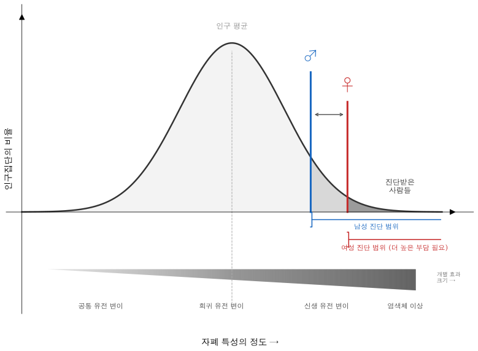
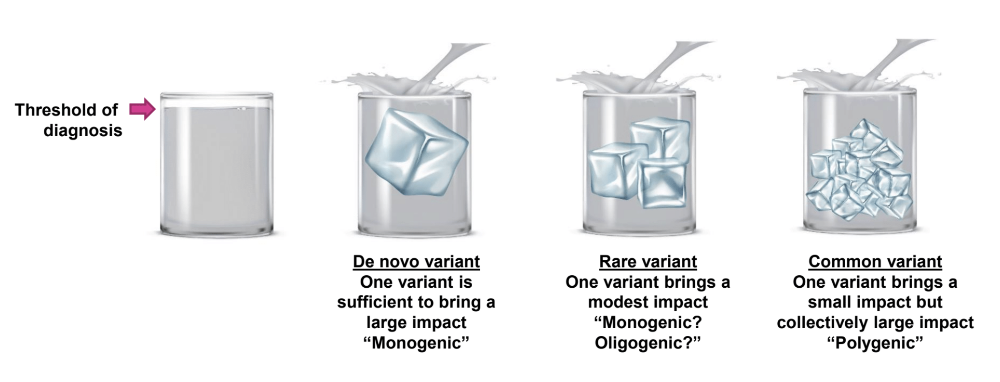

# 21장. 역치 모형과 유전적 부담

앞 장에서 여성 보호 효과를 설명하면서 "역치"라는 개념이 등장했다. 역치 모형(liability threshold model)이 무엇이며 자폐스펙트럼장애의 유전 구조를 이해하는 데 왜 중요한지 한 걸음 더 들어가 살펴보자.

역치 모형은 유전학에서 가장 오래되고 널리 쓰이는 개념 틀의 하나다. 발상은 단순하다. 자폐와 같은 질환은 있거나 없거나로 진단된다. 자폐스펙트럼장애 진단을 받거나 받지 않거나, 둘 중 하나다. 그러나 그 이면에는 연속적인 유전적 부담(genetic liability)이 깔려 있다. 모든 사람은 자폐 위험에 기여하는 유전 변이를 어느 정도 지니며, 그 부담의 합이 특정 역치를 넘으면 자폐 표현형이 드러나고, 넘지 않으면 드러나지 않는다. 물이 컵에 차오르는 것에 견줄 수 있다. 물(유전적 부담)은 연속적으로 차오르지만, 컵이 넘치는 사건(자폐 표현형)은 불연속적이다. 물이 컵 테두리에 닿기 전까지는 아무 일도 일어나지 않다가, 테두리를 넘는 순간 쏟아진다.

이 모형이 쓸모 있는 이유는 여러 관찰을 하나의 틀로 묶어 설명하기 때문이다. 13장에서 다룬 양적유전 구조, 곧 수천 개의 작은 효과를 가진 일반 변이의 합산이 자폐 위험의 대부분을 설명한다는 결과는, 유전적 부담이 연속 분포를 이룬다는 역치 모형의 가정과 잘 맞는다. 5장에서 다룬 가족 내 재발 패턴, 곧 완전 형제의 재발률(약 10배)이 이복 형제(약 3배)보다 높고 사촌(약 2배)보다 높다는 사실도, 유전적 부담이 유전 공유 비율에 비례해 전달되는 연속 변수라는 가정에서 자연스럽게 따라 나온다.

# 역치의 높이는 사람마다 다를 수 있다

앞 장에서 다룬 여성 보호 효과는 역치 모형에 성별에 따른 역치 차이를 도입한 것이다. 남성의 역치가 낮고 여성의 역치가 높다면, 같은 수준의 유전적 부담에서도 남성은 자폐가 나타나고 여성은 나타나지 않을 수 있다. Jacquemont et al. (2014) 연구가 자폐 여성이 남성보다 더 큰 유전적 부담을 짊어지고 있다고 밝힌 결과는, 여성이 더 높은 역치를 넘기 위해 더 많은 유전 위험 요인을 축적해야 했다는 해석으로 이어진다.

다른 것은 성별만이 아닐 수 있다. Weiner et al. (2017) 연구가 보여주었듯이, 큰 효과의 신생변이를 지닌 사람에게서도 양적유전 위험이 추가로 작용했다. 역치 모형의 관점에서 풀면 이렇다. 신생변이가 컵에 물을 한 번에 크게 붓는 것이라면, 양적유전 위험은 작은 물방울 여럿이 합쳐진 것이다. 큰 물 한 번으로 컵이 거의 차더라도, 작은 물방울들이 더해져야 비로소 넘친다. 거꾸로, 같은 신생변이를 지닌 두 사람 가운데 양적유전 위험이 높은 사람은 자폐가 나타나고 낮은 사람은 나타나지 않을 수 있다. 같은 유전 변이를 가져도 표현형이 갈리는 불완전 침투도(incomplete penetrance)의 한 가지 설명이 여기서 나온다.

역치 모형을 한 단계 확장한 것이 다중 역치(multiple thresholds)의 가능성이다. 자폐 없이 넓은 자폐 표현형(BAP)만 보이는 상태, 자폐스펙트럼장애로 진단되는 상태, 자폐에 지적장애와 뇌전증이 동반되는 상태가 유전적 부담의 서로 다른 역치에 대응할지 모른다. Reichenberg et al. (2016) 연구는 경도 지적장애가 일반 IQ 분포의 하단과 연속선상에 있는 반면, 중도 지적장애는 질적으로 구분되는 별도 원인(주로 신생변이)에서 비롯된다는 "불연속 가설(discontinuity hypothesis)"을 지지했다. 자폐에서도 비슷한 구조가 있을 법하다. 양적유전 위험이 연속적으로 쌓여 생긴 자폐와, 단일 유전자의 강한 효과로 생긴 자폐가 질적으로 다를 가능성이다.

# 역치 모형이 말해주는 것과 말해주지 않는 것

역치 모형은 유전적 부담과 표현형 사이의 관계를 개념화하는 틀로 유용하지만, 한계도 있다. 이 모형은 유전적 부담이 무엇으로 이루어졌는지, 어떤 생물학 경로로 뇌에 영향을 주는지에 관해서는 아무것도 말하지 않는다. 컵에 물이 차오른다는 비유에서 물의 성분은 다루지 않는 셈이다. 물이 일반 변이 수천 개의 합산인지, 희귀 신생변이 하나인지, 둘의 조합인지에 따라 생물학 기전이 달라지고, 그렇게 되면 치료적 접근도 달라야 한다.

Dougherty et al. (2022) 연구가 보여주었듯이, 역치 모형의 일부 예측은 경험적으로 일관되게 지지되지 않는다. 모형이 틀렸다기보다 현실이 모형보다 복잡하다는 뜻에 가깝다. 유전적 부담이 성별에 따라 다른 역치를 가진다는 것만으로는 부족하고, 부담의 구성 자체가 성별에 따라 다를 수 있으며(성별 특이적 유전 구조), 같은 유전 변이의 효과 또한 성별에 따라 다를 수 있다(유전자-성별 상호작용). 이 복잡성을 풀려면 더 큰 코호트의 성별 층화 분석과 분자 수준의 성별 특이적 기전 연구가 함께 가야 한다. 역치 모형이 내놓는 유전적 부담의 개념은 성차를 넘어 또 다른 현상으로도 이어진다. 자폐스펙트럼장애가 지적장애, 뇌전증, ADHD와 높은 빈도로 함께 나타나는 동반 질환 현상이 그것이다.

# 이 장을 삶으로 옮길 때

역치 모형은 여러 요인이 합쳐져 어떤 지점에서 표현형이 드러날 수 있다는 설명 도구다. 그러나 그 역치는 사람의 가치나 지원 받을 자격을 나누는 선이 아니다. 부모는 유전적 부담, 환경 요인, 발달 과정의 우연을 더해서 책임의 총량을 계산하려고 애쓸 필요가 없다. 교사는 진단 기준에 가까운 학생에게도 실제 어려움이 보이면 기다리지 말고 환경 조정과 의사소통 지원을 제공해야 한다. 당사자에게는 어떤 역치를 넘었다는 말보다, 현재 어떤 삶의 조건이 부담을 키우고 줄이는지가 더 중요하다. 모형은 복잡성을 설명하기 위한 언어이지, 한 사람의 미래를 판정하는 도구가 아니다.

## 참고문헌

Dougherty, J. D., Marrus, N., Maloney, S. E., et al. (2022). Can the "female protective effect" liability threshold model explain sex differences in autism spectrum disorder? *Neuron*, 110(20), 3243-3262. doi:10.1016/j.neuron.2022.06.020

Jacquemont, S., Coe, B. P., Hersch, M., et al. (2014). A higher mutational burden in females supports a "female protective model" in neurodevelopmental disorders. *American Journal of Human Genetics*, 94(3), 415-425. doi:10.1016/j.ajhg.2014.02.001

Reichenberg, A., Cederlöf, M., McMillan, A., Trzaskowski, M., Kapara, O., Fruchter, E., ... & Lichtenstein, P. (2016). Discontinuity in the genetic and environmental causes of the intellectual disability spectrum. *Proceedings of the National Academy of Sciences*, 113(4), 1098-1103. doi:10.1073/pnas.1508093113

Weiner, D. J., Wigdor, E. M., Ripke, S., Walters, R. K., Kosmicki, J. A., Grove, J., ... & Robinson, E. B. (2017). Polygenic transmission disequilibrium confirms that common and rare variation act additively to create risk for autism spectrum disorders. *Nature Genetics*, 49(7), 978-985. doi:10.1038/ng.3863
