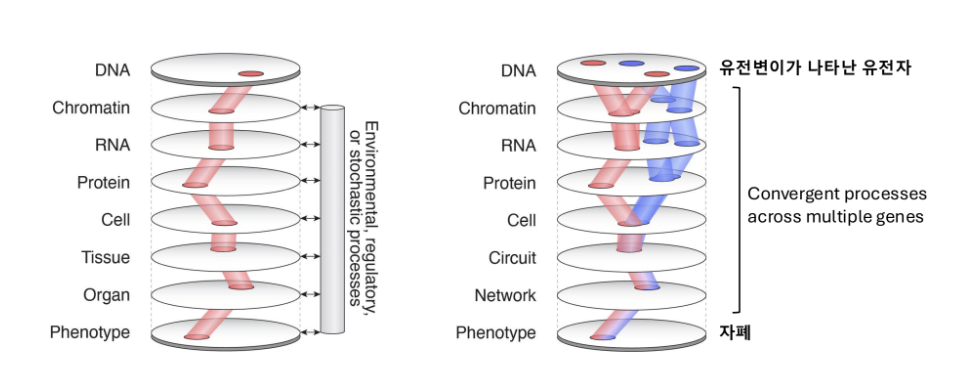

# 24장. 수백 개의 유전자, 세 가지 경로

파트 3에서 우리는 자폐스펙트럼장애에 관여하는 유전 변이가 얼마나 다양한지를 보았고, 파트 4에서는 이 유전적 이질성이 만들어내는 표현형의 다양성을 다루었다. 이제 핵심 질문에 다다른다. 수백 개의 서로 다른 유전자에 변이가 생기는데, 왜 그 결과는 자폐스펙트럼장애라는 비슷한 표현형으로 수렴하는가? 유전적 원인이 수백 가지인데 결과가 어느 정도 닮아 있다면, 그 사이에 어떤 수렴의 구조가 있다는 뜻인가?

답의 실마리는 파트 3에서 이미 등장했다. De Rubeis et al. (2014) 연구는 22개의 자폐 위험 유전자를 확인하면서, 이 유전자들이 유전체 전체에 무작위로 흩어져 있지 않고 세 가지 생물학적 경로에 모여 있음을 발견했다. 시냅스 형성, 전사 조절, 크로마틴 리모델링이 그것이다. 이후 Satterstrom et al. (2020) 연구에서 102개로, Fu et al. (2022) 연구에서 185개로 유전자 목록이 늘어났지만, 이 세 경로로의 수렴은 흔들리지 않았다. 유전자의 수는 늘었지만, 그 유전자들이 맡는 일의 범주는 여전히 소수였다.

이 세 경로가 무엇인지를 좀 더 자세히 살펴보자.

# 시냅스 경로

첫 번째 경로는 시냅스의 형성과 기능에 관여하는 유전자들이다. 시냅스는 뉴런과 뉴런이 만나 신호를 주고받는 접합부라고 앞서 설명했다. 시냅스의 수신 측(postsynaptic density)에는 수백 가지 단백질이 촘촘하게 모여 있는데, 이 단백질들은 신호를 받아들이는 수용체, 수용체를 제자리에 고정하는 뼈대 단백질, 수용체에서 받은 신호를 세포 내부로 전달하는 신호 전달 단백질로 구성된다.

SHANK2와 SHANK3는 이 뼈대 단백질의 핵심 구성원이다. 시냅스 후 치밀질에서 수용체들을 알맞은 위치에 배치하고, 세포 내부의 신호 전달 경로와 연결해주는 역할을 맡는다. SYNGAP1은 시냅스에서 Ras-MAPK 신호 전달 경로를 조절하는 단백질을 만드는 유전자인데, 이 경로는 시냅스의 강도를 장기적으로 조절하는 데 관여한다. 학습과 기억의 분자적 기반으로 알려진 장기 강화(long-term potentiation)가 바로 이 시냅스 강도 조절로 이루어진다. NRXN1(뉴렉신)은 시냅스의 양쪽을 물리적으로 잇는 접착 단백질을 만드는 유전자로, 신호를 보내는 뉴런과 받는 뉴런이 올바르게 연결되도록 해준다. SCN2A는 22장에서 다루었듯 나트륨 채널을 만들어 뉴런의 전기 신호 발생 자체를 담당한다.

이 유전자들에 기능 상실 변이가 생기면 시냅스의 구조가 무너지거나, 신호 전달의 강도가 달라지거나, 뉴런 사이 연결이 부정확해지거나, 전기 신호 자체가 약해지는 결과가 나타난다. 구체적인 분자적 기전은 유전자마다 다르지만, 공통적으로 뉴런 간 소통의 질과 양이 달라진다.

# 크로마틴 리모델링 경로

두 번째 경로는 크로마틴 리모델링에 관여하는 유전자들이다. 크로마틴이란 DNA가 히스톤이라는 단백질에 감겨 있는 구조를 말한다. 유전체 전체가 핵 안에 들어가려면 이렇게 감겨야 하는데, 감긴 정도에 따라 유전자에 대한 접근성이 달라진다. 단단히 감겨 있는 부분은 유전자가 읽히지 않고, 느슨하게 풀린 부분은 유전자가 읽힌다. 크로마틴 리모델링은 이 감김의 정도를 조절하는 과정이다. 도서관에서 책이 잠긴 서가에 있으면 읽을 수 없고, 열린 서가에 있어야 읽을 수 있는 것에 비유할 수 있다. 크로마틴 리모델러는 서가의 잠금장치를 열거나 잠그는 열쇠에 해당한다.

CHD8은 이 경로의 대표적인 유전자다. CHD8 단백질은 히스톤을 밀어내 DNA를 노출시키는 크로마틴 리모델러로, 자폐 위험 유전자 중 가장 많이 연구된 유전자이기도 하다. CHD8에 기능 상실 변이가 생기면 뇌 발달 과정에서 수천 개의 다른 유전자 발현이 한꺼번에 영향을 받는다. 하나의 유전자가 다른 유전자들의 발현을 조절하기 때문에, 그 하나가 망가지면 연쇄적으로 많은 것이 달라진다. ARID1B는 BAF(SWI/SNF) 복합체라는 크로마틴 리모델링 기구의 구성원이고, KDM5C는 히스톤에 붙어 있는 메틸기(methyl group)를 떼어내 유전자 발현을 조절하는 효소를 만든다. ADNP는 ChAHP라는 크로마틴 복합체의 일부로, 특정 유전체 영역의 접근성을 조절한다.

크로마틴 리모델링 유전자가 자폐와 연관되는 이유는, 뇌 발달이 유전자 발현의 정밀한 시공간적 조절에 의존하기 때문이다. 태아기 뇌에서 어떤 유전자가 어느 시점에 켜지고 꺼지느냐가 세포의 운명을 결정한다. 크로마틴 리모델링이 교란되면 이 일정표 전체가 흐트러질 수 있다.

# 전사 조절 경로

세 번째 경로는 전사 조절 인자(transcription factor), 즉 특정 DNA 서열에 결합해 유전자의 발현을 직접 켜거나 끄는 단백질을 만드는 유전자들이다. TBR1은 대뇌 피질 깊은 층의 뉴런 분화에 핵심적인 전사 조절 인자이고, FOXP1은 언어와 인지 발달에 관여하는 전사 조절 인자다. 크로마틴 리모델링이 유전자가 읽힐 수 있는 물리적 환경을 만든다면, 전사 조절 인자는 그 환경이 준비된 유전자를 실제로 읽기 시작하게 하는 신호다.

실제로 크로마틴 리모델링과 전사 조절은 밀접하게 연결된다. CHD8이 크로마틴을 열어주면 전사 조절 인자가 그곳에 결합해 유전자를 켜고, 결과적으로 시냅스 단백질이 만들어진다. 세 경로가 하나의 연쇄적 흐름을 이루는 셈이다. 크로마틴이 열리고(크로마틴 리모델링), 전사 조절 인자가 결합해 유전자가 켜지고(전사 조절), 그 유전자에서 시냅스 단백질이 만들어진다(시냅스 기능). 이 흐름의 어느 단계가 교란되든 최종 결과는 시냅스와 뉴런 소통의 변화로 나타날 수 있다. 수백 개의 서로 다른 유전자가 비슷한 표현형으로 수렴하는 메커니즘이 바로 여기에 있다.

# 이 장을 삶으로 옮길 때

수백 개의 유전자가 세 가지 경로로 모인다는 설명은 자폐인을 세 종류로 나누려는 말이 아니다. 시냅스, 크로마틴, 전사 조절은 발달 과정에서 반복적으로 등장하는 생물학적 길목이며, 한 사람의 삶에서는 여러 길목이 함께 작용할 수 있다. 부모에게 이 장은 유전자 이름이 많아도 제각각 흩어진 이야기만은 아니라는 안도감을 줄 수 있다. 그러나 경로가 보인다고 해서 곧바로 치료법이 정해지는 것은 아니다. 당사자에게는 생물학적 설명이 자신의 경험을 더 좁게 만드는 방식으로 쓰이지 않아야 한다. 교사와 지원자는 세포 안의 경로보다, 그 결과로 나타나는 의사소통과 감각, 학습 요구를 구체적으로 살피는 일이 여전히 중요하다.

## 참고문헌

De Rubeis, S., He, X., Goldberg, A. P., Poultney, C. S., Samocha, K., Cicek, A. E., ... & Buxbaum, J. D. (2014). Synaptic, transcriptional and chromatin genes disrupted in autism. *Nature*, 515(7526), 209-215. doi:10.1038/nature13772

Fu, J. M., Satterstrom, F. K., Peng, M., Brand, H., Collins, R. L., Dong, S., ... & Talkowski, M. E. (2022). Rare coding variation provides insight into the genetic architecture and phenotypic context of autism. *Nature Genetics*, 54(9), 1320-1331. doi:10.1038/s41588-022-01104-0

Satterstrom, F. K., Kosmicki, J. A., Wang, J., Breen, M. S., De Rubeis, S., An, J.-Y., ... & Buxbaum, J. D. (2020). Large-scale exome sequencing study implicates both developmental and functional changes in the neurobiology of autism. *Cell*, 180(3), 568-584. doi:10.1016/j.cell.2019.12.036
